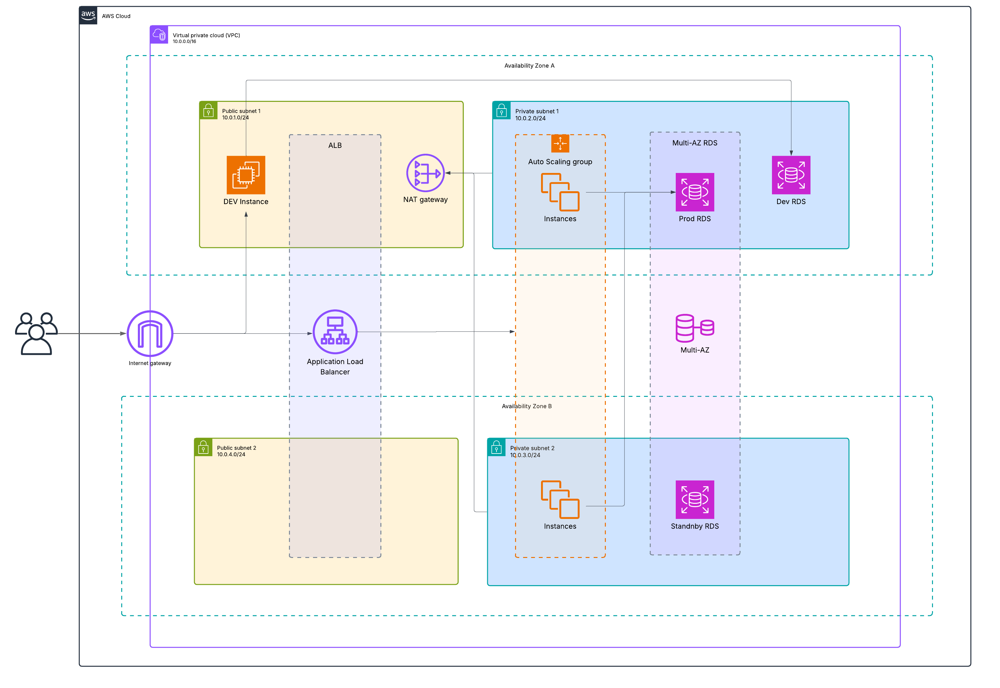
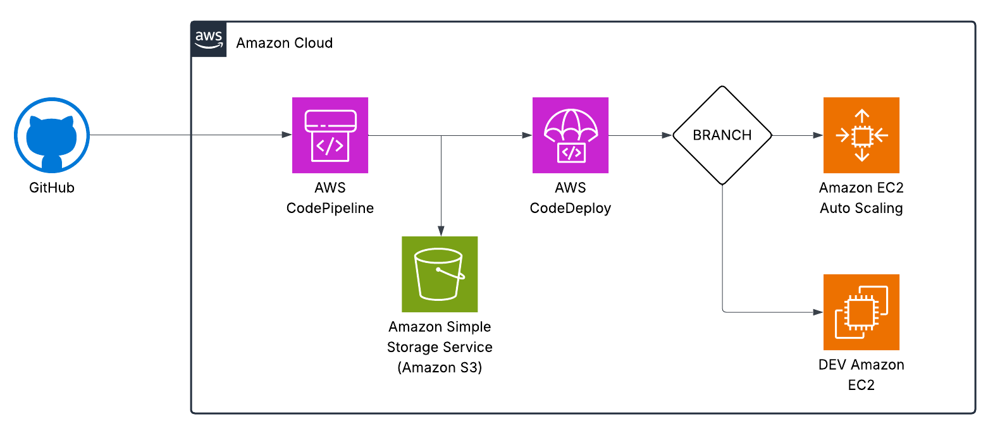

# AWS DevOps Demo App

This repository demonstrates a minimal AWS-based infrastructure and CI/CD pipeline for a simple Node.js application, using CloudFormation and versioned Infrastructure as Code.

## Structure

- `infra/` — CloudFormation stacks for VPC, RDS, and application infrastructure.
- `diagrams/` — Architecture and pipeline diagrams.

## Architecture

- **VPC:** Custom Virtual Private Cloud with public and private subnets.
- **NAT:** NAT Gateway provides internet access for resources in private subnets.
- **RDS:** 
  - Multi-AZ MySQL instance deployed in private subnets for high availability (Production).
  - Single-AZ MySQL instance deployed in private subnet (Development/Testing).
- **EC2:** 
  - Auto Scaling Group for production, behind an Application Load Balancer (ALB).
  - Separate Dev EC2 instance for testing and development deployments.
- **Dev/Prod separation:**  
  Production and development environments are isolated. Dev EC2 instance is used for deployments from the `dev` branch.



## Pipeline

- CI/CD pipeline packages the application as an artifact (e.g., zip archive) and uploads it to an S3 bucket.
- Deployment is triggered from the artifact in S3:  
  - If code is pushed to the `main` branch, deployment goes to the production Auto Scaling Group (ASG).
  - If code is pushed to the `dev` branch, deployment goes to a separate Dev EC2 instance for testing.
- No build or test stage included; pipeline focuses on packaging and deployment.



## Application

A simple Node.js (Express) demo app:

```js
const express = require('express');
const app = express();

console.log('PORT FROM ENV:', process.env.PORT);

app.get('/', (req, res) => {
  res.send('Hello from AWS DevOps demo!');
});

const PORT = process.env.PORT || 8080;
app.listen(PORT, () => {
  console.log(`App running on port ${PORT}`);
});
